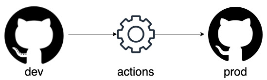

This post will go over how this website's workflow  
The workflow for the website is fairly simple  
There are two repos `dev` and `prod`   
GitHub Actions is setup on the `dev` repository so when there are changes it would push to production at 12:00AM PDT  



Below is an example code on how this is done:  

```yaml
name: Sync changes to prod

on:
  schedule:
    - cron: '0 7 * * *'

jobs:
  sync:
    runs-on: ubuntu-latest
    env:
      DEV_REPO: "dev.zoofytech.github.io"
      PROD_REPO: "zoofytech.github.io"
      USERNAME: "zoofytech"
    steps:
    - name: Checkout repository
      uses: actions/checkout@v2
      with:
        repository: ${{ env.DEV_REPO }}
        token: ${{ secrets.GH_TOKEN }}

    - name: Check for changes
      run: |
        if ! git diff --exit-code HEAD HEAD~1; then
          echo "There have been no changes..exiting"
          exit 0
        fi

    - name: Push changes to prod repository
      run: |
        git remote add {{ env.PROD_REPO }} https://x-access-token:${{ secrets.GH_TOKEN }}@github.com/${{ env.USERNAME }}/{{ env.PROD_REPO }}.git
        git diff --name-only HEAD HEAD~1 | xargs -I{} git push {{ env.PROD_REPO }} HEAD:{} -f
        git log -1 --pretty=%B > commit-message.txt
        git commit --amend -F commit-message.txt
```