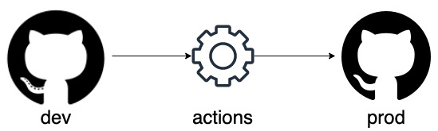

This post will go over how this website's workflow  
The workflow for the website is fairly simple  
There are two repos `dev` and `prod`   
GitHub Actions is setup on the `dev` repository so when there are changes it would `push` to production at 12:00AM PDT  



Below is an example code on how this is done:  

```yaml
name: Sync changes to prod

on:
  schedule:
    - cron: '0 7 * * *'
jobs:
  sync:
    runs-on: ubuntu-latest
    env:
      DEV_REPO: "zoofytech/dev.zoofytech.github.io"
      PROD_REPO: "zoofytech/zoofytech.github.io"
      PROD_REPO_NAME: "zoofytech.github.io"
      USERNAME: "zoofytech"
    steps:
    - name: git-sync
      uses: wei/git-sync@v3
      with:
          source_repo: "https://${{ env.USERNAME }}:${{ secrets.GH_TOKEN }}@github.com/${{ env.DEV_REPO }}"
          source_branch: "main"
          destination_repo: "https://${{ env.USERNAME }}:${{ secrets.GH_TOKEN }}@github.com/${{ env.PROD_REPO }}"
          destination_branch: "main"
```
