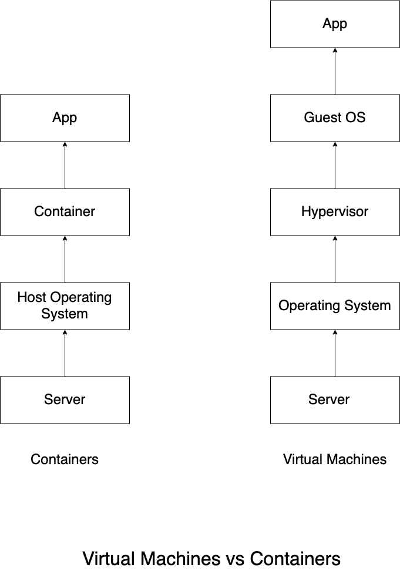

# Docker
This page will go over the basics of docker.

## What is docker?
Docker is a platform that allows you to develop, ship, and run applications in containers. Containers are lightweight, portable, and self-sufficient units that package an application along with its dependencies, libraries, and configuration settings. This enables consistent and reliable deployment across different environments, from development to testing and production.

## Key concepts and components
Below we will go over some of the key concepts and components for docker. We will go over into more details of each in later sections.

1. **Containers** 
Containers are isolated environments that encapsulate an application and its dependencies. They are more lightweight than a virtual machine(VM) since they share the hosts OS's kernel, but they still provide a level of isolation. Containers ensure that applications run the same way across different environments, which reduces the "Well, it works on my machine" problem.
2. **Images**
An image is a read-only template that contains everything needed to run an application. It includes the application's code, runtime, libraries and settings. Images are used to create containers. The best practice is to build images using a `Dockerfile`, which is a script-like configuration file that defines the steps to create the image.
3. **Dockerfile**
 A Dockerfile is a plain text file that contains a series of instructions for building a Docker image. These instructions specify the base image, copy files, install packages, set environment variables, and more. Dockerfiles provide a way to automate the image creation process.
 4. **Registry**
A Docker registry is a repository for Docker images. The most commonly used public registry is `Docker Hub`, where you can find and share images. Organizations often set up private registries to store and manage their proprietary images.
5. **Containerization**
Containerization is the process of packaging an application and its dependencies into a container. This encapsulation ensures that the application runs consistently regardless of the underlying environment.
6. **Docker Engine**
Docker Engine is the core component of Docker that manages containers. It consists of a server that listens for Docker API requests and a command-line interface (CLI) for interacting with Docker.


## Installing
To install docker head over to https://docs.docker.com/get-docker/ there will be specific guides for each OS. If you are installing on Linux, docker desktop is not necessary and you only need to install docker engine: https://docs.docker.com/engine/install/

## Containers

### Containers vs Virtual Machines
As explained earlier, containers are more lightweight than virtual machines. Take the following image as an example



We can see from the above example that Virtual Machines require another operating system. 

### Running a container
Let's run a simple nginx container.
Run the following on a terminal:
`docker run -d -p 8080:80 nginx`

Now if you open up a browser and go to `localhost:8080` the default nginx page will open.
You can also run `curl localhost:8080` to view it in terminal.


1. `docker run` runs processes in isolated containers. 
##### Syntax
`docker run [OPTIONS] IMAGE[:TAG|@DIGEST] [COMMAND] [ARG...]`

##### Options

1. **Foreground** 
By default if detached option is not specified the container will run in foreground mode. In foreground mode, the container can be attached to standard input, output and standard error and this can be configured. 
```
-a=[]           : Attach to `STDIN`, `STDOUT` and/or `STDERR`
-t              : Allocate a pseudo-tty
--sig-proxy=true: Proxy all received signals to the process (non-TTY mode only)
-i              : Keep STDIN open even if not attached
```
If `-a` is not specified, then docker will attach be attached to stdout and stderr. 

`docker run -a stdin -a stdout -it ubuntu /bin/bash`
The above example will run an ubuntu container in interactive shell mode with stdin and stdout
2. **Detached** 
`-d` when starting a container you must decide weather you want to start in detached mode or foreground mode. Containers started in detached mode exit when the root process used to run the container exists, unless you also specify the `--rm` option. If you use `-d` along with `--rm`, the container is removed when it exists or when the daemon exists, whichever happens first. 
`docker run -d -p 8080:80 nginx`
The above example will run nginx in detached mode
3. **Name** 
The operator can identify a container in 3 ways: UUID long id , UUID short id, or Name. The `--name` option allows you to specify a string name making it easier for you to identify a container. 
`docker run --name mynginx -d -p 80:8080 nginx` 
4. **image** 
You can specify a version of an image you'd like by running `image:tag` so for example `docker run nginx:1.0.1` 
5. **Process ID**
By default, all containers have the PID namespace enabled. PID namespace provides separation of processes. The PID Namespace removes the view of the system processes, and allows process ids to be reused. You can even use pid 1.

**Syntax:**
```
--pid=""  : Set the PID (Process) Namespace mode for the container,
            'container:<name|id>': joins another container's PID namespace
            'host': use the host's PID namespace inside the container
```
In some cases you may want your container to share the host's process namespace, basically allowing the processes within the container to see all the processes on the system. 
```
# Run a Docker container with PID namespace sharing
docker run --rm -it --name pid-sharing --pid=host busybox

# Inside the container, install htop
# You might need to adjust the package manager based on the container's base image
apk add htop

# Run htop to monitor host system processes from within the container
htop

```
The above example, you run the container with the `--pid host` option which shares the same host's PID namespace with the container. This allows the processes within the container to see and interact with the processes on the host system. Byh installing and running `htop` inside the container, you can monitor the host system's processes in real-time.
6. **Network Settings**
By default, all containers have networking enabled and they can make any outgoing connections. The operator can completely disable networking with `docker run -network none` which disables all incoming and outgoing networking. In cases like this, you would perform I/O through files or `STDIN` and `STDOUT` only. 
Publishing ports and linking to other containers only work with the default network(bridge). THe linking feature is a legacy feature. YOu should always prefer using Docker network drivers over linking.
##### Syntax
```
--dns=[]           : Set custom dns servers for the container
--network="bridge" : Connect a container to a network
                    'bridge': create a network stack on the default Docker bridge
                    'none': no networking
                    'container:<name|id>': reuse another container's network stack
                    'host': use the Docker host network stack
                    '<network-name>|<network-id>': connect to a user-defined network
--network-alias=[] : Add network-scoped alias for the container
--add-host=""      : Add a line to /etc/hosts (host:IP)
--mac-address=""   : Sets the container's Ethernet device's MAC address
--ip=""            : Sets the container's Ethernet device's IPv4 address
--ip6=""           : Sets the container's Ethernet device's IPv6 address
--link-local-ip=[] : Sets one or more container's Ethernet device's link local IPv4/IPv6 addresses
```
Your container will always use the same DNS servers as the host by default, but oyu can override this by using `--dns`

By default, the MAC address is generated using the IP address allocated to the container.  You can set the container’s MAC address explicitly by providing a MAC address via the `--mac-address` parameter `(format:12:34:56:78:9a:bc)`.

**Supported networks**
|Network| 	Description|
| ----------- | ----------- |
|none |	No networking in the container.|
|bridge (default) |	Connect the container to the bridge via veth interfaces.|
|host| 	Use the host's network stack inside the container.|
|container:[name\|id] |	Use the network stack of another container, specified via its name or id.|
|NETWORK 	| Connects the container to a user created network (using docker network create command)|
**none**
With the network is `none` a container will not have any access to external routes. 
**bridge**
With bridge the container will use docker's default networking setup. A brdige is setup on the host, commonly `docker0` and a pair of `veth` interfaces will be created for the container. 
An IP address will be allocated for containers on the bridge's network and traffic will be routed through this bridge to the container. Containers can communicate via their IP addresses by default. 
**host**
When `host` is used the network will share the host's network stack and all interfaces form the host will be available to the container. The hostname of the container will be the same as the host's hostname. 
**container**
Using `container` a container will share the network stack of another container. The other container's name must be provided in the format of `--network container: <name|id>`. 
**User-defined network**
You can create a network using a Docker network driver or an external network driver plugin. You can connect multiple containers to the same network. Once connected to a user-defined network, the containers can communicate easily using only another container’s IP address or name.

For `overlay` networks or custom plugins that support multi-host connectivity, containers connected to the same multi-host network but launched from different Engines can also communicate in this way.
7. **Restart policies**
The `--restart` flag allows you to specify a restart policy for how a container should or shouldn't be restarted on exit.
The following policies are allowed:
**no**
Do not automatically restart container when exits. This is the default option.
**on-failure:maxretries**
Restart only if the container exits with a non-zero exit status. Optionally, limit the number of restart retries.
**always**
Always restart the container regardless of exit status. 
**unless-stopped**
Always restart the container regardless of the exit status except if the container was put into a stopped state before the Docker daemon was stopped.
8. **Clean  up**
By default a container's file system persists even after the container exits. You can automatically clean up the container and remove the file system when the container exists using the `--rm` flag.
`docker run -rm busybox`
9. **Kernel memory and user memory**
You can set the user memory using the `-m` flag along with the amount
`docker run -it -m 500M ubuntu  /bin/bash`
You can also set the kernel memory using the flag `--kernel-memory` along with the amount.
`docker run -it -m 500M --kernel-memory 50M ubtunu`
10. **CMD**
You can run docker with a command using a command. `docker run ubuntu echo "Hello world"`
11. **ENTRYPOINT**
The `--entrypoint=` option is similar to the CMD option because it specifies what to run when the container starts but it is more difficult to override. 
```
docker run -it --entrypoint /bin/bash example/redis -c ls -l
```
The above example runs the entrypoint to `/bin/bash` on the image `example/redit` with the command `ls -l`
11.  **EXPOSE**
The following are options for container networking for incoming ports:
```
--expose=[]: Expose a port or a range of ports inside the container.
            These are additional to those exposed by the `EXPOSE` instruction
-P         : Publish all exposed ports to the host interfaces
-p=[]      : Publish a container's port or a range of ports to the host
            format: ip:hostPort:containerPort | ip::containerPort | hostPort:containerPort | containerPort
            Both hostPort and containerPort can be specified as a
            range of ports. When specifying ranges for both, the
            number of container ports in the range must match the
            number of host ports in the range, for example:
                -p 1234-1236:1234-1236/tcp

            When specifying a range for hostPort only, the
            containerPort must not be a range.  In this case the
            container port is published somewhere within the
            specified hostPort range. (e.g., `-p 1234-1236:1234/tcp`)

            (use 'docker port' to see the actual mapping)

--link=""  : Add link to another container (<name or id>:alias or <name or id>)
```
`docker run --expose=3030 -name mycontainer mycontainer`
The above example exposes port 3030 for mycontainer
12. **ENV**
You can set more environment variables using the `-e` flag. 
`docker run -e "hello=world" alpine env`
The above example runs the apline container with the environment variable `hello=world` and shows all of the containers variables using the `env` command.
13. **Volumes**
The volume option allow you to mount filesystem volumes to the container. 
##### Syntax
```
-v, --volume=[host-src:]container-dest[:<options>]: Bind mount a volume.
The comma-delimited `options` are [rw|ro], [z|Z],
[[r]shared|[r]slave|[r]private], and [nocopy].
The 'host-src' is an absolute path or a name value.

If neither 'rw' or 'ro' is specified then the volume is mounted in
read-write mode.

The `nocopy` mode is used to disable automatically copying the requested volume
path in the container to the volume storage location.
For named volumes, `copy` is the default mode. Copy modes are not supported
for bind-mounted volumes.

--volumes-from="": Mount all volumes from the given container(s)
```
`docker run -v /path/on/host:/path/in/container:ro -it ubuntu`
The above example will bind a volume `/path/on/host` to `/pth/in/container` with the read-only option on the `ubuntu` container.
13. **USER**
You can create additional users using the `-u ` or `--user` option.
##### Syntax
```
-u="", --user="": Sets the username or UID used and optionally the groupname or GID for the specified command.

The followings examples are all valid:
--user=[ user | user:group | uid | uid:gid | user:gid | uid:group ]
```
By default, user `0` is `root` on the container. 
`docker run -u username:1000 -it ubuntu`
The above example will create the user `username` with the group id number of `1000`
14. **WORKDIR**
The default working directory for containers is `/`. To change the default working directory you can use `--workdir` or `-w=` option.
`docker run -w /hello/world -it ubuntu`
The above example will run the container `ubuntu` with the working dir of `/hello/world`

### Docker images


#### Docker Pull
The `docker pull` command will allow you to pull images from a registry. We will talk about registries in a later section. 
##### Syntax
`docker pull [OPTIONS] NAME[:TAG|@DIGEST]`

##### OPTIONS
| Name                                         | Type     | Description                                      |
|:---------------------------------------------|:---------|:-------------------------------------------------|
| [`-a`](#all-tags), [`--all-tags`](#all-tags) |          | Download all tagged images in the repository     |
| `--disable-content-trust`                    |          | Skip image verification                          |
| `--platform`                                 | `string` |  Set platform if server is multi-platform capable |
| `-q`, `--quiet`                              |          | Suppress verbose output                          |

**Examples**
`docker pull ubuntu`
The above example will pull the latest ubuntu
`docker pull ubuntu:22.04`
The above example will pull ubuntu 22.04
`docker pull ubuntu@sha256:26c68657ccce2cb0a31b330cb0be2b5e108d467f641c62e13ab40cbec258c68d`
You can even pull by the digest as the above example shows.
#### Docker tag
A docker tag allows you to label specific versions of an image.  Tags are used to differentiate and manage different versions or variations of an image. Images are typically identified by a combination of their repository name and tag.

##### Syntax
`docker tag SOURCE_IMAGE[:TAG] TARGET_IMAGE[:TAG]`
**Examples**
`docker tag myapp:latest myregistry/myapp:v1.0
`
The above example tags `myapp:latest` to a registry `myregistry` with a new tag of `1.0`
`docker tag 0e152351 myapp:1.0`
The above example tags the image id of `0e152351` using the default docker registry to `myapp:1.0`
#### docker commit
`docker commit` allows you to commit container file changes or settings into a new image. 
Personally, I don't think that `docker commit` is the best because it is not reusable like a docker file which we will go over in a later section. `docker commit` is useful in cases where you would need to quickly update a container image and make changes. 

##### Syntax
`docker commit [OPTIONS] CONTAINER [REPOSITORY[:TAG]]`

##### Options

| Name                                   | Type     | Description                                                |
|:---------------------------------------|:---------|:-----------------------------------------------------------|
| `-a`, `--author`                       | `string` |Author (e.g., `John Hannibal Smith <hannibal@a-team.com>`) |
| [`-c`](#change), [`--change`](#change) | `list`   |Apply Dockerfile instruction to the created image          |
| `-m`, `--message`                      | `string` |Commit message                                             |
| `-p`, `--pause`                        |          |  Pause container during commit                              |
##### Example
```
docker run -it ubuntu /bin/bash
touch 1 2 3
exit
docker ps -a
docker commit 13bcccdbbc74 testrepository/testimage:v1
docker images
```
The above example :
1. we run the latest `ubuntu` container in the terminal.
2. We then  create files `1 2 3`
3. We then exit the container
4. We use `docker ps -a` to view all containers and find the latest one updated was `13bcccdbbc74`
5. We then commit container `13bcccdbbc74` to `testrepository` with the new image name of `testimage` with the tag `v1` 
6. Finally we few the image by using the `docker images` command


#### Docker Push
THe `docker push` command allows you to push images into a registry
##### Syntax
`docker push [OPTIONS] NAME[:TAG]`

##### Options


| Name                                         | Description                                 |
|:---------------------------------------------|:--------------------------------------------|
| [`-a`](#all-tags), [`--all-tags`](#all-tags) | Push all tags of an image to the repository |
| `--disable-content-trust`                    | Skip image signing                          |
| `-q`, `--quiet`                              |  Suppress verbose output                    |

##### Example
Earlier we had committed a new image. We can use that same example to push the image to a repository.
```
docker run -it ubuntu /bin/bash
touch 1 2 3
exit
docker ps -a
docker commit 13bcccdbbc74 testrepository/testimage:v1
docker images
docker tag testrepository/testimage:v1 testrepository/testimage:latest
docker push testrepository/testimage:latest
```

### Cleanup
Below we will go over some of the docker commands to cleanup containers and images.


#### docker stop
`docker stop` allows you to stop one or more containers. The main process inside the container will receive `SIGTERM`, and after a grace period, `SIGKILL`. The first signal can be changed with the `STOPSIGNAL`
instruction in the container's Dockerfile, or the `--stop-signal` option to
`docker run`.

##### Options

| Name             | Type     | Default | Description                                  |
|:-----------------|:---------|:--------|:---------------------------------------------|
| `-s`, `--signal` | `string` |         | Signal to send to the container              |
| `-t`, `--time`   | `int`    | `0`     | Seconds to wait before killing the container |


#### docker kill
`docker kill` will allow you to kill one or more running containers. The main process
inside the container is sent `SIGKILL` signal (default), or the signal that is
specified with the `--signal` option. You can reference a container by its
ID, ID-prefix, or name.

##### Options

| Name                                   | Type     |Description                     |
|:---------------------------------------|:---------|:--------------------------------|
| [`-s`](#signal), [`--signal`](#signal) | `string` |Signal to send to the container |

#### docker rm
`docker rm` allows you to remove one or more containers

##### Options

| Name                                      |  Description                                             |
|:------------------------------------------|:--------------------------------------------------------|
| [`-f`](#force), [`--force`](#force)       |  Force the removal of a running container (uses SIGKILL) |
| [`-l`](#link), [`--link`](#link)          |  Remove the specified link                               |
| [`-v`](#volumes), [`--volumes`](#volumes) |  Remove anonymous volumes associated with the container  |

#### docker rmi
`docker rmi` allows you to remove one or more images. It also un-tags images attached to the image mentioned as well.


### Options

| Name            |  Description                   |
|:----------------|:-------------------------------|
| `-f`, `--force` | Force removal of the image     |
| `--no-prune`    | Do not delete untagged parents |


### Docker Registry
 By default, docker uses docker hub - https://hub.docker.com/ as a registry to pull and push images.


#### docker login
`docker login` helps lets you login to a registry

You must have a privileged user to use `docker login` such as using `sudo` or `root` access unless you have the following:
1. connecting to a remote daemon such as `docker machine` provisioned `docker engine`.
2. The user is added to `docker` group. 

`docker login [OPTIONS] [SERVER]`

##### Options

| Name                                  | Type     |  Description                  |
|:--------------------------------------|:---------|:-----------------------------|
| `-p`, `--password`                    | `string` |  Password                     |
| [`--password-stdin`](#password-stdin) |          |  Take the password from stdin |
| `-u`, `--username`                    | `string` | Username                     |

##### Examples
`docker login localhost:8080` 
The above example logins to a  self-hosted registry

`cat pwd.txt | docker login --username user1 --password-stdin`
The above example uses `pwd.txt` to read as `STDIN` with the username `user1`


##### Credential stores
The Docker Engine can keep user credentials in an external credential store,
such as the native keychain of the operating system. Using an external store
is more secure than storing credentials in the Docker configuration file.

To use a credential store, you need an external helper program to interact
with a specific keychain or external store. Docker requires the helper
program to be in the client's host `$PATH`.

You can download the helpers from the `docker-credential-helpers`
[releases page](https://github.com/docker/docker-credential-helpers/releases).
Helpers are available for the following credential stores:
- D-Bus Secret Service
- Apple macOS keychain
- Microsoft Windows Credential Manager
- [pass](https://www.passwordstore.org/)

##### Configure the credential store

You need to specify the credential store in `$HOME/.docker/config.json`
to tell the docker engine to use it. The value of the config property should be
the suffix of the program to use (i.e. everything after `docker-credential-`).
For example, to use `docker-credential-osxkeychain`:

```json
{
  "credsStore": "osxkeychain"
}
```

If you are currently logged in, run `docker logout` to remove
the credentials from the file and run `docker login` again.

##### Credential helper
Credential helpers are similar to the credential store above, but act as the
designated programs to handle credentials for *specific registries*. The default
credential store (`credsStore` or the config file itself) will not be used for
operations concerning credentials of the specified registries.

##### Configure credential helpers

If you are currently logged in, run `docker logout` to remove
the credentials from the default store.

Credential helpers are specified in a similar way to `credsStore`, but
allow for multiple helpers to be configured at a time. Keys specify the
registry domain, and values specify the suffix of the program to use
(i.e. everything after `docker-credential-`).
For example:

```json
{
  "credHelpers": {
    "registry1.com": "registryhelper1",
    "registry2.com": "registryhelper2",
    "registry3.com": "registryhelper3"
  }
}
```

#### dock logout
`docker logout` allows you to log out from a registry. If no service is specified, the default is defined by the daemon.

##### Example
`docker logout localhost:8080`


#### Configure a private registry
A registry is a storage and content delivery system that holds named images. You can tag each image with versions as well.

##### Running a local registry
To run a local registry use the following:
`docker run -d -p 5000:5000 --restart=always --name registry registry:1`

##### Using the registry
Similarly to the default registry(docker hub), you can push, pull, and remove images.

```
docker pull ubuntu:22.04
docker tag ubuntu:22.04 localhost:5000/new-ubuntu
docker push localhost:5000/new-ubuntu
docker image remove ubuntu:22.04
docker image remove localhost:5000/new-ubuntu
docker pull localhost:5000/new-ubuntu
```
The above example does the following:
1. Pull image `ubuntu:22.04` from docker hub
2. tag image `ubuntu:22.04` with the tag `localhost:5000/new-ubuntu`
3. Push image `localhost:5000/new-ubuntu` to registry
4. remove both `ubuntu:22.04` and `localhost:5000/new-ubuntu` images locally
5. Pull `localhost:5000/new-ubuntu` from registry to local

To stop the local registry, use the same `docker container stop`

```
docker container stop registry1
docker container rm -v registry1
```


### Archive containers
Docker allows you to import and export containers via tarball

#### Docker export
`docker export` allows you to export a container's filesystem as a tar archive
If the container has volumes associated it will not export those contents.

##### Options

| Name             | Type     | Description                        |
|:-----------------|:---------|:-----------------------------------|
| `-o`, `--output` | `string` | Write to a file, instead of STDOUT |


```
docker run ubuntu:22.04
docker  export ubuntu:22.04 > hello.tar
docker export --output="hello.tar" ubuntu:22.04
```
#### Docker import
`docker import` allows you to import exported docker tarballs.

##### Options

| Name              | Type     | Description                                       |
|:------------------|:---------|:--------------------------------------------------|
| `-c`, `--change`  | `list`   | Apply Dockerfile instruction to the created image |
| `-m`, `--message` | `string` | Set commit message for imported image             |
| `--platform`      | `string` | Set platform if server is multi-platform capable  |


### Troubleshooting
Below we will go over some docker command line trouble shooting options.

#### docker ps
`docker ps` allows you to list containers

##### Options

| Name                                   | Type     | Default | Description                                                                                                                                                                                                                                                                                                                                                                                                                          |
|:---------------------------------------|:---------|:--------|:-------------------------------------------------------------------------------------------------------------------------------------------------------------------------------------------------------------------------------------------------------------------------------------------------------------------------------------------------------------------------------------------------------------------------------------|
| [`-a`](#all), [`--all`](#all)          |          |         | Show all containers (default shows just running)                                                                                                                                                                                                                                                                                                                                                                                     |
| [`-f`](#filter), [`--filter`](#filter) | `filter` |         | Filter output based on conditions provided                                                                                                                                                                                                                                                                                                                                                                                           |
| [`--format`](#format)                  | `string` |         | Format output using a custom template:<br>'table':            Print output in table format with column headers (default)<br>'table TEMPLATE':   Print output in table format using the given Go template<br>'json':             Print in JSON format<br>'TEMPLATE':         Print output using the given Go template.<br>Refer to https://docs.docker.com/go/formatting/ for more information about formatting output with templates |
| `-n`, `--last`                         | `int`    | `-1`    | Show n last created containers (includes all states)                                                                                                                                                                                                                                                                                                                                                                                 |
| `-l`, `--latest`                       |          |         | Show the latest created container (includes all states)                                                                                                                                                                                                                                                                                                                                                                              |
| [`--no-trunc`](#no-trunc)              |          |         | Don't truncate output                                                                                                                                                                                                                                                                                                                                                                                                                |
| `-q`, `--quiet`                        |          |         | Only display container IDs                                                                                                                                                                                                                                                                                                                                                                                                           |
| [`-s`](#size), [`--size`](#size)       |          |         | Display total file sizes                                                                                                                                                                                                                                                                                                                                                                                                             |
##### Filter options
| Filter                | Description                                                                                                                          |
|:----------------------|:-------------------------------------------------------------------------------------------------------------------------------------|
| `id`                  | Container's ID                                                                                                                       |
| `name`                | Container's name                                                                                                                     |
| `label`               | An arbitrary string representing either a key or a key-value pair. Expressed as `<key>` or `<key>=<value>`                           |
| `exited`              | An integer representing the container's exit code. Only useful with `--all`.                                                         |
| `status`              | One of `created`, `restarting`, `running`, `removing`, `paused`, `exited`, or `dead`                                                 |
| `ancestor`            | Filters containers which share a given image as an ancestor. Expressed as `<image-name>[:<tag>]`,  `<image id>`, or `<image@digest>` |
| `before` or `since`   | Filters containers created before or after a given container ID or name                                                              |
| `volume`              | Filters running containers which have mounted a given volume or bind mount.                                                          |
| `network`             | Filters running containers connected to a given network.                                                                             |
| `publish` or `expose` | Filters containers which publish or expose a given port. Expressed as `<port>[/<proto>]` or `<startport-endport>/[<proto>]`          |
| `health`              | Filters containers based on their healthcheck status. One of `starting`, `healthy`, `unhealthy` or `none`.                           |
| `isolation`           | Windows daemon only. One of `default`, `process`, or `hyperv`.                                                                       |
| `is-task`             | Filters containers that are a "task" for a service. Boolean option (`true` or `false`)                                               |
##### Example
show the latest container
`docker ps -l`

Show all containers even the stopped ones
`docker ps -a`


#### docker history
To show the history of an image you can use `docker history` command


##### Options

| Name                  | Type     | Default | Description                                                                                                                                                                                                                                                                                                                                                                                                                          |
|:----------------------|:---------|:--------|:-------------------------------------------------------------------------------------------------------------------------------------------------------------------------------------------------------------------------------------------------------------------------------------------------------------------------------------------------------------------------------------------------------------------------------------|
| [`--format`](#format) | `string` |         | Format output using a custom template:<br>'table':            Print output in table format with column headers (default)<br>'table TEMPLATE':   Print output in table format using the given Go template<br>'json':             Print in JSON format<br>'TEMPLATE':         Print output using the given Go template.<br>Refer to https://docs.docker.com/go/formatting/ for more information about formatting output with templates |
| `-H`, `--human`       |          |         | Print sizes and dates in human readable format                                                                                                                                                                                                                                                                                                                                                                                       |
| `--no-trunc`          |          |         | Don't truncate output                                                                                                                                                                                                                                                                                                                                                                                                                |
| `-q`, `--quiet`       |          |         | Only show image IDs                                                                                                                                                                                                                                                                                                                                                                                                                  |

##### Format options

| Placeholder     | Description                                                                                               |
|-----------------|-----------------------------------------------------------------------------------------------------------|
| `.ID`           | Image ID                                                                                                  |
| `.CreatedSince` | Elapsed time since the image was created if `--human=true`, otherwise timestamp of when image was created |
| `.CreatedAt`    | Timestamp of when image was created                                                                       |
| `.CreatedBy`    | Command that was used to create the image                                                                 |
| `.Size`         | Image disk size                                                                                           |
| `.Comment`      | Comment for image                                                                                         |


##### Examples
`docker history ubuntu:22.04`
show history of ubuntu:22.04

`docker history --format "{{.ID}}: {{.CreatedSince}}" ubuntu:22.04`
Show history of `ubuntu:22.04` without headers and outputs the `ID` and `CreatedSince` entries separated by a colon `:`

#### docker info
`docker info` allows you to display system wide information regarding the Docker installation.

##### Syntax
`docker info [OPTIONS]`

##### Options

| Name      | Type     | Description |
|:---------------------------------------|:---------|:---------------------------------------|
| [`-f`](#format), [`--format`](#format) | `string` |Format output using a custom template:<br>'json':             Print in JSON format<br>'TEMPLATE':         Print output using the given Go template.<br>Refer to https://docs.docker.com/go/formatting/ for more information about formatting output with templates |


#### docker events
To get system events use `docker events`
Only the last 1000 log events are displayed. You can use filters to further limit the number of events displayed. 


##### Options

| Name                                   | Type     |  Description                                   |
|:---------------------------------------|:---------|:----------------------------------------------|
| [`-f`](#filter), [`--filter`](#filter) | `filter` |Filter output based on conditions provided    |
| [`--format`](#format)                  | `string` |Format the output using the given Go template |
| [`--since`](#since)                    | `string` |Show all events created since timestamp       |
| `--until`                              | `string` | Stream events until this timestamp            |


#### docker top
To display the number of running processes of a container run `docker top`


#### docker inspect
`docker inspect` allows you to display low level information on docker objects.


##### Options

| Name                                   | Type     |Description|
|:---------------------------------------|:---------|:-----|
| [`-f`](#format), [`--format`](#format) | `string` |Format output using a custom template:<br>'json':             Print in JSON format<br>'TEMPLATE':         Print output using the given Go template.<br>Refer to https://docs.docker.com/go/formatting/ for more information about formatting output with templates |
| [`-s`](#size), [`--size`](#size)       |  | Display total file sizes if the type is container |
| [`--type`](#type)                      | `string` |Return JSON for specified type     |


#### docker stats
`docker stats` shows a live data stream for running containers. 


##### Options

| Name                  | Type     | Description  |
|:----------------------|:---------|---------------|
| `-a`, `--all`         |          |Show all containers (default shows just running)|
| [`--format`](#format) | `string` | Format output using a custom template:<br>'table': Print output in table format with column headers (default)<br>'table TEMPLATE':   Print output in table format using the given Go template<br>'json':             Print in JSON format<br>'TEMPLATE': Print output using the given Go template.<br>Refer to https://docs.docker.com/go/formatting/ for more information about formatting output with templates |
| `--no-stream`         |           | Disable streaming stats and only pull the first result  |
| `--no-trunc`          |      | Do not truncate output                                                                                                                                                                                                                                                                                                                                                                                                               |

##### format options
| Column name               | Description                                                                                   |
|---------------------------|-----------------------------------------------------------------------------------------------|
| `CONTAINER ID` and `Name` | the ID and name of the container                                                              |
| `CPU %` and `MEM %`       | the percentage of the host's CPU and memory the container is using                            |
| `MEM USAGE / LIMIT`       | the total memory the container is using, and the total amount of memory it is allowed to use  |
| `NET I/O`                 | The amount of data the container has received and sent over its network interface             |
| `BLOCK I/O`               | The amount of data the container has written to and read from block devices on the host       |
| `PIDs`                    | the number of processes or threads the container has created                                  |

#### docker search
`docker search` allows you to search docker hub for images.

##### Options

| Name                                   | Type     | Default | Description                                |
|:---------------------------------------|:---------|:--------|:-------------------------------------------|
| [`-f`](#filter), [`--filter`](#filter) | `filter` |         | Filter output based on conditions provided |
| [`--format`](#format)                  | `string` |         | Pretty-print search using a Go template    |
| [`--limit`](#limit)                    | `int`    | `0`     | Max number of search results               |
| [`--no-trunc`](#no-trunc)              |          |         | Don't truncate output                      |


#### docker exec
`docker exec` allows you to run commands in a container. 

##### Options

| Name                                      | Type     | Default | Description                                            |
|:------------------------------------------|:---------|:--------|:-------------------------------------------------------|
| `-d`, `--detach`                          |          |         | Detached mode: run command in the background           |
| `--detach-keys`                           | `string` |         | Override the key sequence for detaching a container    |
| [`-e`](#env), [`--env`](#env)             | `list`   |         | Set environment variables                              |
| `--env-file`                              | `list`   |         | Read in a file of environment variables                |
| `-i`, `--interactive`                     |          |         | Keep STDIN open even if not attached                   |
| `--privileged`                            |          |         | Give extended privileges to the command                |
| `-t`, `--tty`                             |          |         | Allocate a pseudo-TTY                                  |
| `-u`, `--user`                            | `string` |         | Username or UID (format: `<name\|uid>[:<group\|gid>]`) |
| [`-w`](#workdir), [`--workdir`](#workdir) | `string` |         | Working directory inside the container                 |

Running `docker exec` with the `-c` option allows you to chain commands with `&&`
##### Example
`docker exec -it ubuntu -c "echo hello && echo world"`

#### docker diff
`docker diff` allows you to list the changed files and directories in a container's file system since the container was created.
The following are different types of changes that are tracked:
| Symbol | Description                     |
|--------|---------------------------------|
| `A`    | A file or directory was added   |
| `D`    | A file or directory was deleted |
| `C`    | A file or directory was changed |


### docker volume
Docker volume is a way to persist and manage data separately from the lifecycle of a container. In many cases, you might have data that you want to retain even if the container is removed or replaced. This is where Docker volumes come into play.

#### create
`docker volume create` allows you to create a new volume that containers can consume and store data in. If a name isn't specified, Docker generates a random name.

##### Syntax
`docker volume create [OPTIONS] [VOLUME]`

##### options

| Name                          | Type     | Default  | Description                                                            |
|:------------------------------|:---------|:---------|:-----------------------------------------------------------------------|
| `--availability`              | `string` | `active` | Cluster Volume availability (`active`, `pause`, `drain`)               |
| `-d`, `--driver`              | `string` | `local`  | Specify volume driver name                                             |
| `--group`                     | `string` |          | Cluster Volume group (cluster volumes)                                 |
| `--label`                     | `list`   |          | Set metadata for a volume                                              |
| `--limit-bytes`               | `bytes`  | `0`      | Minimum size of the Cluster Volume in bytes                            |
| [`-o`](#opt), [`--opt`](#opt) | `map`    | `map[]`  | Set driver specific options                                            |
| `--required-bytes`            | `bytes`  | `0`      | Maximum size of the Cluster Volume in bytes                            |
| `--scope`                     | `string` | `single` | Cluster Volume access scope (`single`, `multi`)                        |
| `--secret`                    | `map`    | `map[]`  | Cluster Volume secrets                                                 |
| `--sharing`                   | `string` | `none`   | Cluster Volume access sharing (`none`, `readonly`, `onewriter`, `all`) |
| `--topology-preferred`        | `list`   |          | A topology that the Cluster Volume would be preferred in               |
| `--topology-required`         | `list`   |          | A topology that the Cluster Volume must be accessible from             |
| `--type`                      | `string` | `block`  | Cluster Volume access type (`mount`, `block`)                          |

##### Example

```
mkdir /hello
docker volume create --driver local \ 
    --opt type=nfs \
    --opt o=192.168.1.2,rw \
    --opt device=:/hello \
    new_volume01
```
1. We create the directory `/hello`
2. Use `nfs` to mount the path `/hello`
3. The volume is mounted in `rw` mode from `192.168.1.2`
4. name the volume `new_volume01`

#### rm
`docker volume rm` allows you to remove one or more volumes. You cannot remove a volume that is in use by a container.

##### Options

| Name            |  Description                              |
|:----------------|:-----|
| `-f`, `--force`  | Force the removal of one or more volumes |

##### Example
```
docker volume rm new_volume01
```
The above example removes volume `new_volume01` 


#### ls
`docker volume ls` allows you to list all volumes known to Docker. 


### Options

| Name                                   | Type     |Description                                                                                                                                                                                                                                                                                                                                                                                                                          |
|:---------------------------------------|:--------|:-------------------------------------------------------------------------------------------------------------------------------------------------------------------------------------------------------------------------------------------------------------------------------------------------------------------------------------------------------------------------------------------------------------------------------------|
| `--cluster`                            |  | Display only cluster volumes, and use cluster volume list formatting                                                                                                                                                                                                                                                                                                                                                                 |
| [`-f`](#filter), [`--filter`](#filter) | `filter`  | Provide filter values (e.g. `dangling=true`)                                                                                                                                                                                                                                                                                                                                                                                         |
| [`--format`](#format)                  | `string` | Format output using a custom template:<br>'table':            Print output in table format with column headers (default)<br>'table TEMPLATE':   Print output in table format using the given Go template<br>'json':             Print in JSON format<br>'TEMPLATE':         Print output using the given Go template.<br>Refer to https://docs.docker.com/go/formatting/ for more information about formatting output with templates |
| `-q`, `--quiet`                        |  | Only display volume names                  

##### Filter options
| Placeholder   | Description                                                                           |
|---------------|---------------------------------------------------------------------------------------|
| `.Name`       | Volume name                                                                           |
| `.Driver`     | Volume driver                                                                         |
| `.Scope`      | Volume scope (local, global)                                                          |
| `.Mountpoint` | The mount point of the volume on the host                                             |
| `.Labels`     | All labels assigned to the volume                                                     |
| `.Label`      | Value of a specific label for this volume. For example `{{.Label "project.version"}}` |

##### Example
```
docker volume create 123
docker volume create 456
docker volume ls
```

#### update
`docker volume update` allows you to update cluster volumes

##### Options

| Name             | Type     | Default  | Description                                              |
|:-----------------|:---------|:---------|:---------------------------------------------------------|
| `--availability` | `string` | `active` | Cluster Volume availability (`active`, `pause`, `drain`) |

#### inspect
`docker volume inspect` allows you to display information about a volume. By default it renders all results in a JSON array. 

##### Options

| Name                                   | Type     | Description                                                                                                                                                                                                                                                        |
|:---------------------------------------|:---------|:-------------------------------------------------------------------------------------------------------------------------------------------------------------------------------------------------------------------------------------------------------------------|
| [`-f`](#format), [`--format`](#format) | `string` |  Format output using a custom template:<br>'json':             Print in JSON format<br>'TEMPLATE':         Print output using the given Go template.<br>Refer to https://docs.docker.com/go/formatting/ for more information about formatting output with templates |


#### prune
`docker volume prune` allows you to remove unused local volumes


##### Options

| Name                          | Type     |Description                                        |
|:------------------------------|:---------|:---------------------------------------------------|
| [`-a`](#all), [`--all`](#all) |          | Remove all unused volumes, not just anonymous ones |
 [`--filter`](#filter)         | `filter`| Provide filter values (e.g. `label=<label>`)       |
 | `-f`, `--force`               |          | Do not prompt for confirmation                     |


### Docker secrets
#### create
#### inspect
#### ls
#### rm

### Dockerfile
#### Docker build