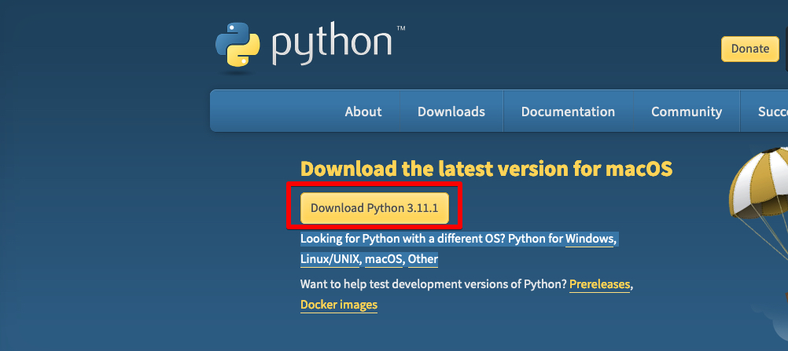
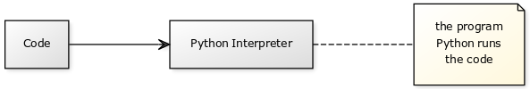

# Python Basics 
This page will go over the basics of python. It is meant to be quick and getting your feet wet. If you are interested in more details of topics feel free to use Google. This should be enough information here to start out doing some easy leetcode questions
This tutorial will go over Python 3+ as it is the most recent one.  

## Download Python
To download python go to https://www.python.org/downloads/ and download the version for your OS

## Install IDE
There are several different types of IDE's for python:
- [Pycharm](https://www.jetbrains.com/pycharm/download/)
- [VSCode](https://code.visualstudio.com/download)

We use VSCode for this tutorial as it has functions for multiple other languages and is not only for python

## Basics
### Print function
The `print()` function in python is used to print specified message on the screen. It can print strings or objects which are then converted to a string while on the screen

**Examples:**

**Input**
```python
print ("HELLO ZOOFYTECH")
```
**Output**
```
HELLO ZOOFYTECH
```

**Input**
```python
print("ABC")
print("123")
print("xyz")
print("890")
```

**Output**
```
ABC
123
xyz
890
```

**Input**
```python
print ("Hello\nWorld")
```
The `\n` will put a new line
**Output**
```
Hello
World
```

### Execute Scripts
To run Python programs, you will need the Python interpreter and possibly an editor(IDE).
A Python interpreter executes Python code (sometimes called programs).
A program can be one or more Python files. Code files can include other files or modules. To run a program, you need to specify a parameter when executing Python.


There are several ways to execute a python file.
1. Execute the file using `python` command on terminal
`python hello.py`
1. If the file has a shebang on the first line to call the python interpreter such as `#!/usr/bin/env python3` or `#!/usr/bin/python3` then you can run the script by just typing in the file name as long as it is executable. To make it executable first run `chmod +x hello.py` then run `hello.py`
1. Run on from IDE. On the IDE you can run the program. On vscode right click the file you are in and run it in interactive mode(this will require install of jupyter notebook)


### Variables 
A Python variable is a reserved memory location to store values. 
Every value in Python has a datatype. The following are the different types:  integers (numbers), float (decimal numbers), booleans (true or false) and strings (text).
Variables in Python can be declared by any name or even alphabets like a, aa, abc, etc. 

Below are some examples of variables. Please try them out on your IDE 

**Example 1**  
```python
# This is a comment 
# a is the variable 
a=900
print (a)
```

**Example 2**  

```python
b=2
print(b)
# re-declaring the var to 3 and printing it
b=3
print(b)
```

**Example 3**  
Concatenation is only possible if you use the same type of datatype.  

```python
a=100
b="cool people"
# This will fail
print a+b
```
One can change the integer to a string by putting a `str` before it
```python
a=100
b="cool people"
print(str(a)+b)
```
**Example 4**  
There are two types of variables in Python, Global variable and Local variable. When you want to use the same variable for the entire program or module you declare it as a global variable. 

To set a global variable, it must be outside of a function. We'll talk more about functions later
> > **Note:**  
For best practices, people tend to set global variables using all capital letters 

```python
GLOBAL_VAR=200
print(GLOBAL_VAR)

# Create function called funFunction 
def funFunction():
    print(GLOBAL_VAR)

# Call the function
funFunction()
```
**Example 5**   
To change a global variable inside a function use the `global` keyword 
```python
GLOBAL_VAR=200
print(GLOBAL_VAR)

# Create function called funFunction 
def funFunction():
    global GLOBAL_VAR
    GLOBAL_VAR="new global var"
    print(GLOBAL_VAR)

# Call the function
funFunction()
```
**Example 6**  
You can also delete variables using the `del` command
```python
l =11
print(l)

del l
print(l)
```
The above should output `NameError: name 'l' is not defined`

### Strings
Python can manipulate strings which can be expressed in several ways. Strings can be enclosed in single quotes `'..'` or double quotes `".."` and `\` can be used to escape special characters such as quotes 

```python
print('hello') #single quote
print("world") # Double quote
print('it doesn\'t have to be this fun') # use \ to escape quote
print("it doesn't have to be this fun" # or just use double quotes instead)
print('"No," yes!')
```

Strings prefixed with `r` or `R`, such as `r'...' `and `r"..."`, are called raw strings and treat backslashes `\` as literal characters. In raw strings, escape sequences are not treated specially.

```python
print(r'a\tb\nA\tB')
print('a\tb\nA\tB')
```

You can also use triple quotes for multiple lines such as `"""..."""` `'''...'''`
```python
print("""
Usage: [OPTIONS]
     -h                        Display this usage message
     -H hostname               Hostname to connect to
""")
```

Strings can be concatenated (glued together) with the `+` operator, and repeated with `*`:
```python
print(3*'hi') # 3 times hi
print("hello" + "man") # print helloman
```
Two or more string literals next to each other are automatically concatenated 
This is great for breaking long strings:
```python
long_string= ('lets put some very long strings in different lines ' 
'but put them together by concatenation')
print(long_string)
```

It only works for two literals though not variables. If you want to concatenate variables or a variable and literal then you can use the `+`
```python
a='cats'
print(a + " and dogs")
```

Strings can be indexed with the first character having an index of `0`. 

```python
word="verylongword"
print(word[0])
print(word[-1]) # can go negative for the last character
print(word[-12]) # print the first character
print(word[-2])  # print 2nd to last character
```

Strings can also be sliced. While indexing is used to get individual characters, `slicing` allows you to get multiple strings:
```python
word="verylongword"
print(word[0:2]) # prints positions 0-2
print(word[2:5]) # prints positions 2-5
print(word[:2]) # prints positions from beginning to position 2(excluded)
print(word[3:])# prints position 3 until end(included)
print(word[-2:]) # prints positions second to last until end 
```
Note how the start is always included, and the end always excluded. This makes sure that `s[:i] + s[i:]` is always equal to `s`:
```python
word="verylongword"
print(word[:2])
print(word[2:])
print(word[:2] + word[2:])
```

Strings cannot be changed as they are immutable. Therefore, assigning to an indexed position in the string results in an error:
```python
word[0]='J' #this will fail
word[2:]='test' #this will also fail 
```

The built in function `len` returns the length of a string
```python
word='verylongword'
len(word)
```

### Numbers

### Lists

### Replace

### Join

### String find 

### Split

### Read input 

## Flow Control

### if statements 

### for loops

### while loops

### range function

### break and continue statements

### pass Statements

### match Statements

### Defining Functions

### More on Defining Functions

### Default Argument Values

### Keyword Arguments

### Special parameters

###  Positional-or-Keyword Arguments

### Positional-Only Parameters

### Keyword-Only Arguments

### Function Examples

### Arbitrary Argument Lists

### Unpacking Argument Lists

### Lambda Expressions

### Documentation Strings

### Function Annotations


## Data Structures

### More on Lists

### Using Lists as Stacks

### Using Lists as Queues

### List Comprehensions

###  Nested List Comprehensions

### The del statement

### Tuples and Sequences

### Sets

### Dictionaries

### Looping Techniques

### More on Conditions

### Comparing Sequences and Other Types


## Modules

### More on Modules

### Executing modules as scripts

### The Module Search Path

### “Compiled” Python files

### Standard Modules

### The dir() Function

### Packages

### Importing * From a Package

### Intra-package References

### Packages in Multiple Directories


## Input and Output

### Fancier Output Formatting

###  Formatted String Literals

### The String format() Method

### Manual String Formatting

###  Old string formatting

### Reading and Writing Files

###  Methods of File Objects

### Saving structured data with json


## Errors and Exceptions

### Syntax Errors

### Exceptions

### Handling Exceptions

### Raising Exceptions

### Exception Chaining

### User-defined Exceptions

### Defining Clean-up Actions

### Predefined Clean-up Actions

### Raising and Handling Multiple Unrelated Exceptions

### Enriching Exceptions with Notes

## Classes

### A Word About Names and Objects

### Python Scopes and Namespaces

### Scopes and Namespaces Example

### A First Look at Classes

### Class Definition Syntax

###  Class Objects

### Instance Objects

### Method Objects

### Class and Instance Variables

### Random Remarks

### Inheritance

### Multiple Inheritance

### Private Variables

### Odds and Ends

### Iterators

### Generators

### Generator Expressions


## Brief Tour of the Standard Library

### Operating System Interface

### File Wildcards

### Command Line Arguments

###  Error Output Redirection and Program Termination

### String Pattern Matching

### Mathematics

### Internet Access

### Dates and Times

### Data Compression

### Performance Measurement

### Quality Control

### Batteries Included


## Brief Tour of the Standard Library — Part II


### Output Formatting

### Templating

### Working with Binary Data Record Layouts

### Multi-threading

### Logging

### Weak References

### Tools for Working with Lists

### Decimal Floating Point Arithmetic


## Virtual Environments and Packages

### Introduction

### Creating Virtual Environments

### Managing Packages with pip


## What Now?


## Interactive Input Editing and History Substitution

### Tab Completion and History Editing

### Alternatives to the Interactive Interpreter

## Floating Point Arithmetic: Issues and Limitations

### Representation Error

## Appendix

### Interactive Mode

### Error Handling

### Executable Python Scripts

### The Interactive Startup File

### The Customization Modules